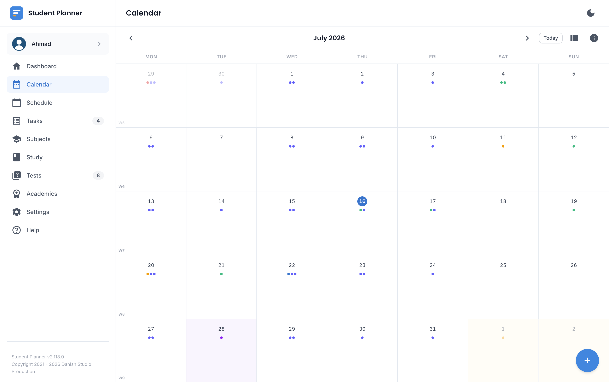
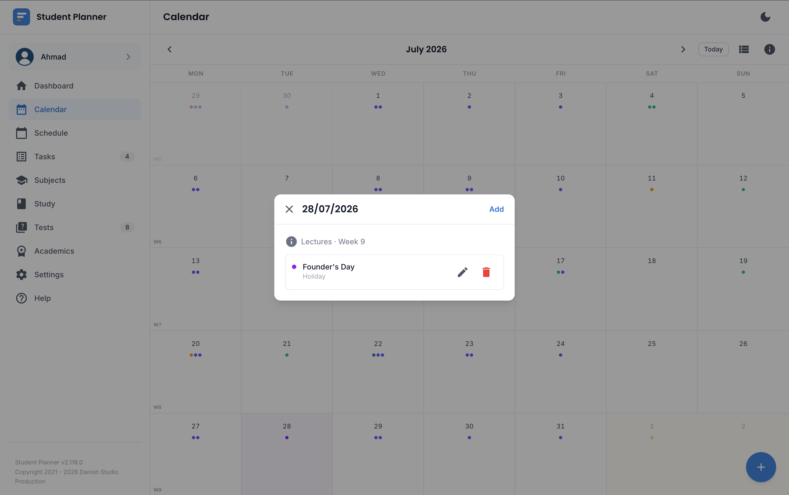

# Calendar

A month view that brings your classes, deadlines, and holidays/events together in one place, colour-tinted
by whichever semester period (lecture weeks, break, exam period, or a custom period type) each day
falls under.

## Reading the grid

- Each Monday shows a small badge with that week's teaching-week number.
- Days tint by the semester period covering them.
- Holidays and events show as small coloured dots.

## Day details

Tap/click a day to see everything on it — classes, quizzes/tests, tasks, and holidays/events — and jump
straight to any of them (this deep-links back to the Schedule, Quiz, or Homework page it came from).

!!! note "Mobile vs. desktop layout"
    On a phone, this opens inline below the grid so you can keep scrolling the day list without losing
    the month view. On a larger screen it opens as a floating dialog instead, since there's enough room
    that a fixed panel would just push the calendar off-screen.

## Events and holidays

Add your own events (with an optional multi-day span) or mark holidays directly on the Calendar — a
holiday behaves like any other no-class period and blocks that day's classes from showing.

## Different semester

If you page to a month with no overlap at all with your currently active semester, the Calendar shows a
clear "different semester" notice with a link back to Academics, instead of a sparse or misleading empty
grid.
