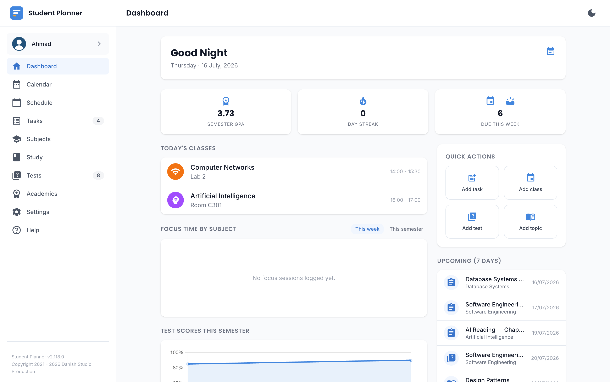

# Dashboard

The Dashboard is the home screen — a quick-glance summary of what's happening, plus quick actions to
add new items.

## What's on it

- **Quick actions** — add a task, add a class, and other common shortcuts (also reachable via keyboard,
  see below).
- **Today's classes** — pulled straight from your Schedule, including the alternating-week (Week A/B)
  pattern if you use one. On a day with no classes (a break, holiday, exam, or other no-class period),
  this shows a banner instead of an empty list.
- **Upcoming deadlines** — unfinished tasks, tests, and study topics with a due date, due within the
  next 7 days.
- **Analytics** — for your active semester:
    - GPA, a day streak (consecutive days with a logged focus session), and an upcoming-deadlines count.
    - A Pomodoro time-by-subject chart (This week / This semester toggle).
    - A quiz/test score trend chart.
    - **Focus suggestions** — study topics under 100% progress with an upcoming linked test, so you
      always have a "what to revise next" answer instead of guessing.

!!! tip "GPA showing \"~\"?"
    A `~` before your GPA means it's a projection, not a final number — see the note in
    [Subjects & Academics](academics.md#subjects-and-grading).

## Customize dashboard

Tap the tune icon (⚙) next to the greeting to show/hide any card above, or reorder it within its own
column — for example, hiding Quote of the day, or moving Test scores above Focus time by subject.
Changes save automatically and sync with the rest of your account.

## Home screen / desktop widget

Your next class, today's schedule, this month's calendar, and more — right on your home screen or
desktop, no need to open the app. There are 14 different widgets in fixed sizes (not resizable — each
one is its own design, not a size variant of another), covering things like a month grid, a combined
date+agenda view, and a quick "Add event" shortcut, plus a dedicated
[Pomodoro focus session widget](pomodoro.md#home-screen-desktop-widget).

How you add one depends on your platform:

- **Android** — a real home screen widget, any of all 14. Long-press your home screen → Widgets →
  Student Planner to browse and add whichever ones you want, or tap **Add the Everything widget** in
  Settings for a one-tap shortcut to a representative default.
- **macOS** — a real Notification Center widget, also all 14. Add one from the system's own Widget
  gallery (click the date/time in the menu bar, or right-click the desktop, then choose "Edit Widgets").
- **Windows and Linux** — a small floating widget window showing your current Pomodoro session (the
  other 13 calendar/agenda designs aren't available in this floating-window form, only on Android/macOS
  above). Turn it on/off with the toggle in Settings.

!!! warning "macOS's Notification Center widgets aren't showing correctly right now"
    We're still tracking down why the real WidgetKit widgets don't render correctly on a real Mac at
    the moment (this doesn't affect Android at all). **As a workaround, macOS also offers the same
    floating widget window Windows/Linux use** — Settings shows that toggle on macOS too, and it
    currently only covers the Pomodoro session widget, same as Windows/Linux.

## Keyboard shortcuts

Available anywhere in the app (not just the Dashboard), as long as you're not typing in a text field:

| Key | Action |
|---|---|
| `n` | Add a task |
| `c` | Add a class |
| `p` | Pause/resume an active Pomodoro session |
| `?` | Show the shortcuts help overlay |

!!! tip "Your phone's back button/swipe gesture works too"
    Any open dialog or bottom sheet in the app (add/edit forms, the sync status panel, and so on)
    closes on your device's own back button or back-swipe gesture, the same way it would in a native
    app — it won't accidentally navigate you out of the app entirely.
