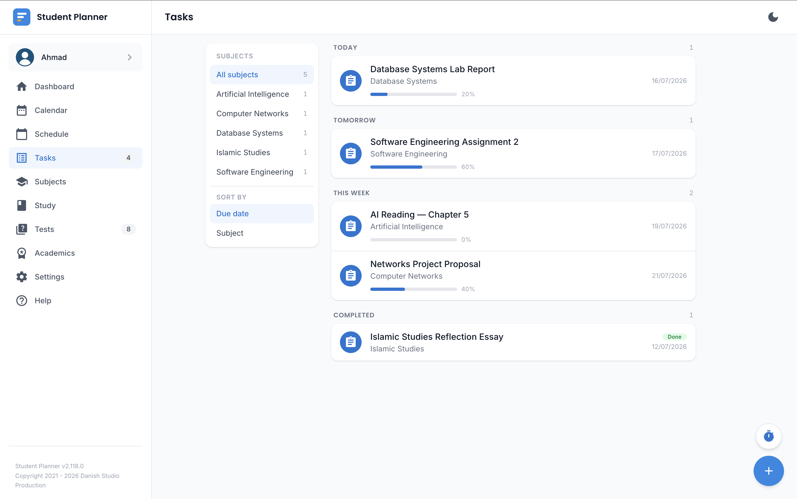
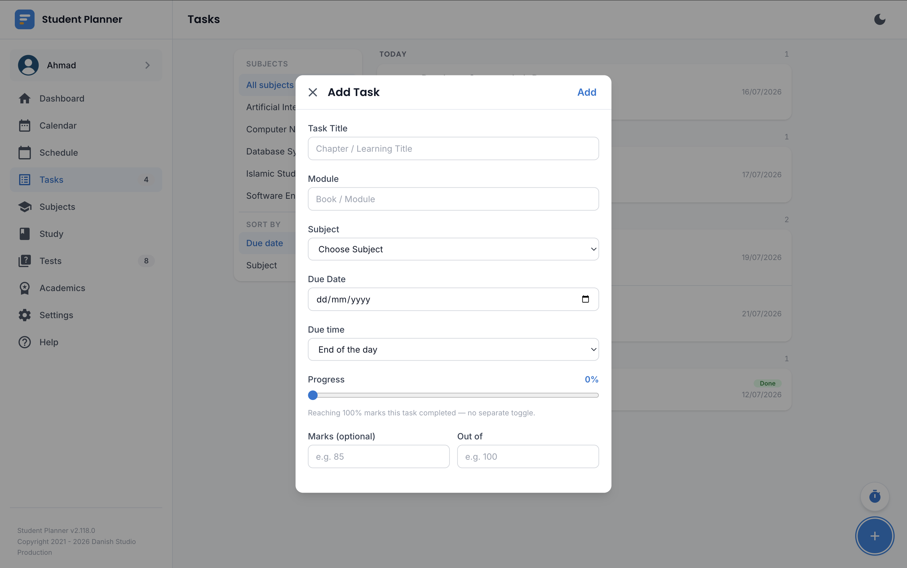

# Homework & Tasks

Track anything with a deadline — assignments, readings, projects — separately from tests (which live
under [Quiz & Tests](quiz.md)).

## Adding a task

A task needs a title and a due date at minimum. You can optionally set a due **time** in one of two
ways:

- **During class** — picks the end time of a class you select, so the task is due "by the end of that
  lecture."
- **Custom time** — pick any time directly; if you leave it blank, it auto-fills from your default
  class duration setting the same way Schedule does.

## Progress and completion

A task's completion is driven entirely by its **progress** slider (0-100%), not a separate status
picker — drag it to 100% and the task marks itself **Completed** automatically; drag it back down and
it un-completes just as automatically. Only a completed task is excluded from the Dashboard's
upcoming-deadlines count, so partial progress still counts as "not done yet" there.

## Notes

Every task has a notes field that renders as formatted Markdown (headings, lists, bold/italic, links)
once you leave edit mode — handy for a checklist or extra instructions pasted from a syllabus.

## Timezones and studying abroad

!!! info "Only relevant if your programme is based somewhere else"
    If a task has a due **time** and your programme has a
    [timezone override](academics.md#programmes) set, that time is entered in the programme's
    timezone and displayed converted for wherever you actually are, the same as a scheduled class.
