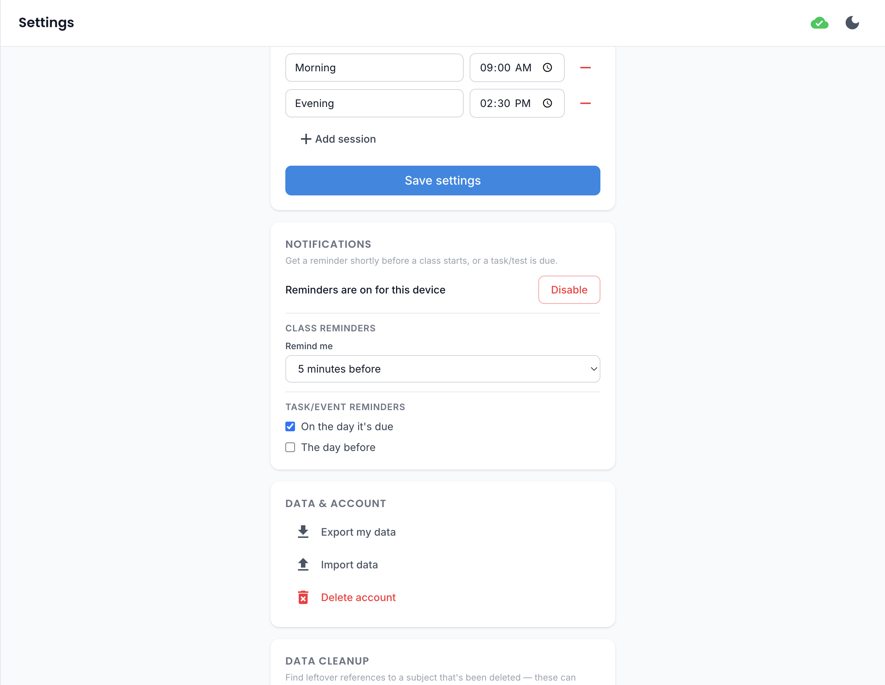

# Notifications

Optional push notifications for upcoming classes and deadlines — turned off by default, opt in from
[Settings](settings.md).

## Turning them on

Enabling notifications registers this device to receive push reminders and requires your browser's
notification permission. This isn't available for a guest session that hasn't linked to a real account
yet, since reminders need somewhere to be delivered from server-side.

## Class reminders

Choose how far ahead of a class you want to be nudged — 5, 10, 15, 30, or 60 minutes before it starts —
from the **Remind me** selector in Settings.

## Deadline reminders

Two independent toggles control when you're reminded about a task/test deadline:

- **On the day it's due** — a reminder the same day something's due.
- **The day before** — an earlier heads-up, so you're not finding out at the last minute.

Both can be on at once, or just one — whichever fits how far ahead you like to plan.

Rather than firing at the same clock time for everyone, both are timed around your own class schedule
for the day the reminder actually fires: "on the day" fires an hour before your first class that day,
and "the day before" fires 10 minutes after your last class ends. On a day with no classes, they fall
back to a fixed time in the late afternoon/evening instead.

## Turning them off

Turning notifications off removes this device's registration entirely, so no further reminders are
sent to it.

## Desktop and Android apps

Notifications work a little differently in the native desktop and Android apps — see the
[platform support table](index.md#platform-support) for the short version. Android gets real push,
same as the web app; desktop notifications only fire while the app is actually open, since a desktop
app has no way to wake itself up in the background the way a phone can. Turning notifications on/off
in Settings works the same way on every platform either way.

## iPhone/iPad (iOS)

!!! warning "Notifications only work once the app is on your Home Screen"
    Safari's rules mean a web app only receives push notifications if it's been added to your Home
    Screen and opened from there (not from a regular Safari tab). If you try to enable notifications
    before doing that, Settings will tell you so up front — look for the **Share → Add to Home Screen**
    option in Safari, then reopen the app from the icon it creates before trying again.

!!! warning "Guest data can be silently deleted after ~2 weeks"
    This isn't specific to notifications, but it's an iOS platform rule worth knowing if you use the app
    on iPhone/iPad as a guest: if you don't open the app for about two weeks, iOS may automatically
    clear its local storage to free up space — and since a guest session has no cloud backup, that data
    is unrecoverable. If you plan to keep using the app on iOS, either open it at least every couple of
    weeks or [create an account](../getting-started/guest-vs-account.md) so your data is safely backed
    up to the cloud instead.
