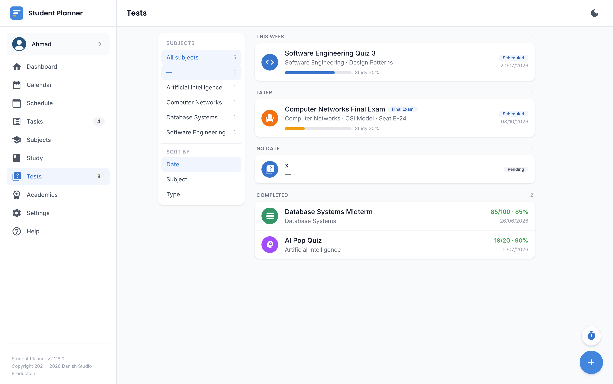
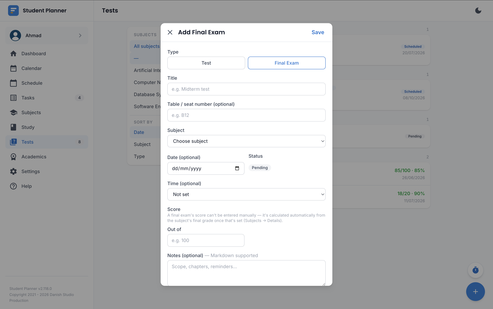

# Quiz & Tests

Track quizzes, tests, and Final Exams — with scores, status, and an optional linked focus/revision
trail.

## Regular quizzes/tests

Set a date and (optionally) a time, a topic link, and a status.

!!! tip "You don't need to close it out yourself"
    Once the scheduled time passes, an unfinished quiz automatically flips to **Completed** — there's
    no separate button to click. Add a score once it's graded (any time before or after that automatic
    flip), and it feeds the Dashboard's score-trend chart.

## Final Exams

Toggle **Final Exam** on the same form to switch it into exam mode. This adds:

- A **seat/table number** field.
- Quick-pick buttons for the exam's start time, one per **exam session** you've defined in
  [Settings](settings.md#preferences) (e.g. "Morning", "Evening", or any custom label/time you've set
  up there) — final exam schedules are usually published in session blocks rather than exact times, so
  picking a session fills in its start time for you.

A Final Exam is otherwise the same underlying record as a regular quiz — topic links, focus sessions,
and score all carry over, and it shows up everywhere a regular quiz would (Calendar, Dashboard's
upcoming deadlines, Schedule's day view).

!!! note "End time defaults"
    If you leave the end time blank, it fills in from the start time plus your **default examination
    length** (Settings) for a Final Exam, or your **default class duration** for a regular quiz/test —
    two separate settings, since exams usually run much longer than a class.

## Pomodoro focus sessions

Log a [Pomodoro focus session](pomodoro.md) against a quiz to build up a time-by-subject breakdown on
the Dashboard, and feed the Dashboard's focus suggestions. If you have an active session running when
one of today's classes or quizzes is about to start, it automatically pauses itself instead of
silently running through it.

## Timezones and studying abroad

!!! info "Only relevant if your programme is based somewhere else"
    If your programme has a [timezone override](academics.md#programmes) set (for example, a degree
    based in a different country than where you're physically studying), a quiz/exam's date and time
    are entered in that programme's timezone. Whatever device you actually view it from converts and
    displays it correctly for wherever you currently are — the same way a scheduled class or task due
    time behaves. Most users never need to touch this.
