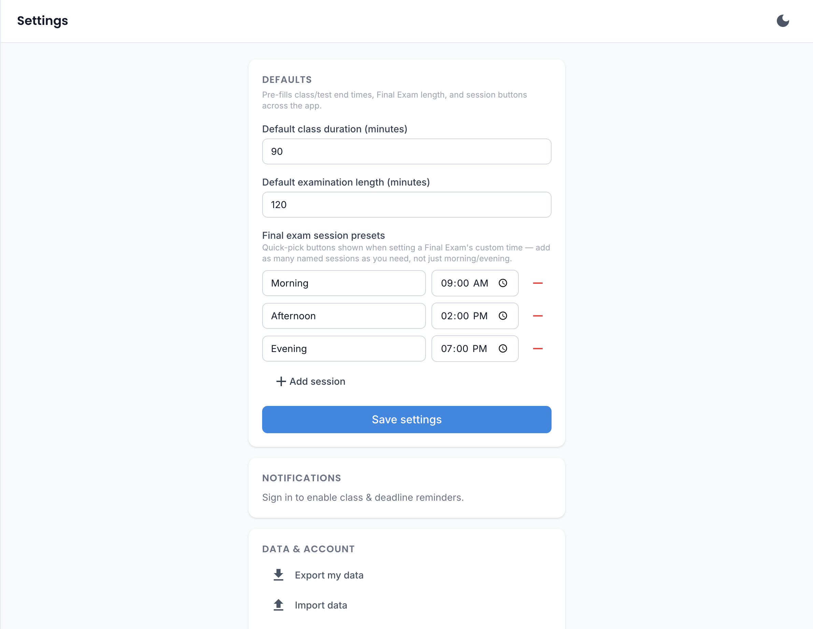
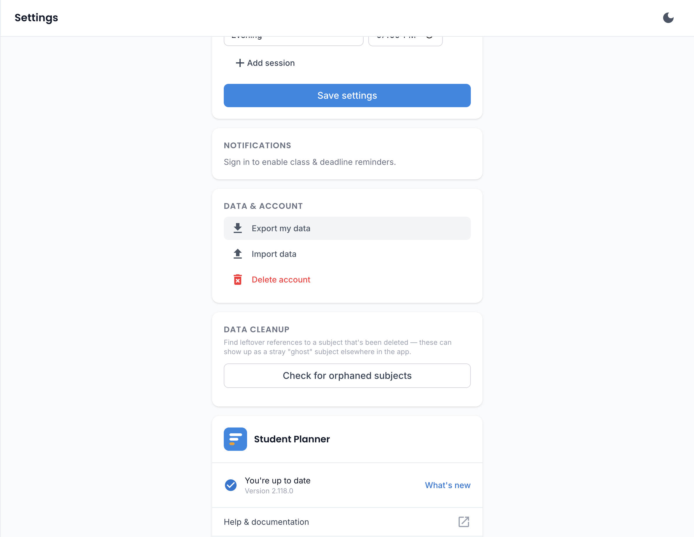

# Settings

All app-wide preferences and data/account management live on a dedicated Settings page, reachable from
the sidebar.

## Preferences

- **Default class duration** — how long a class or task's time block is when you don't set an end time
  yourself; used by Schedule, the Homework due-time picker, and Quiz custom-time mode.
- **Default examination length** — the same idea, but specifically for a [Final Exam](quiz.md#final-exams)'s
  end time, since exams usually run much longer than a regular class (defaults to 2 hours).
- **Exam sessions** — a free-form, editable list of named time presets (e.g. "Morning" at 09:00,
  "Evening" at 14:30) that show up as quick-pick buttons on a Final Exam's start time field. Add,
  rename, or remove sessions to match however your institution actually schedules exams — it's not
  locked to just morning and evening.
- **Notification reminder timing** — see [Notifications](notifications.md).

!!! tip "iPhone/iPad users"
    If notifications aren't turning on, check whether the app was added to your Home Screen first —
    see the note in [Notifications](notifications.md#iphoneipad-ios).

## Home screen / desktop widgets

See the [Dashboard](dashboard.md#home-screen-desktop-widget) for what's available on each platform —
this is where you turn the floating widget window on/off (Windows, Linux, and macOS), or pin a
one-tap default widget (Android's **Add the Everything widget** button).

## Google Calendar sync

Automatically keeps your classes, tasks, and quizzes up to date on your own Google Calendar — no
manual export needed, and no toggle to remember to press again after the first time.

- **Connect** — signs you in with Google and grants the app permission to manage events on your
  calendar. From then on, a class, task, or quiz you add, edit, or delete in Student Planner is
  reflected on your Google Calendar automatically, on its own schedule (not instantly) — no "Sync now"
  button to press.
- **Disconnect** — stops the sync and revokes the app's access to your Google Calendar. Events already
  created there aren't automatically removed.

Works the same way on web, desktop, and Android — connect once on whichever platform you're using, and
it keeps running independently of whether the app itself is open, since the actual sync happens on our
server rather than your device.

!!! info "Not available for a guest session"
    Google Calendar sync needs a real signed-in account (there's nowhere for it to sync from for a
    guest, local-only session) — [create an account](../getting-started/guest-vs-account.md) first if
    you'd like to use it.

## Data & account

- **Export my data** — downloads everything you've entered as a single JSON file. Works fully offline
  and for guests too, since it reads straight from the local database.
- **Import data** — load a previously exported JSON file back in.
- **Delete account** — permanently removes your account and everything in it, on every device.

!!! danger "This can't be undone"
    Deleting your account removes everything — schedule, tasks, tests, study progress, grades — on
    every device, with no recovery option. [Export your data](../data/export-import.md) first if there's
    any chance you'll want it later.

## About

The About card shows the current app version, a changelog of what's new in recent updates (with a
"View update history" button for everything before that), and links to the
[Privacy Policy](../data/privacy-and-terms.md), [Terms and Conditions](../data/privacy-and-terms.md),
and open-source licenses used by the app.

On the desktop and Android apps, About also shows the installed app's own version separately from the web
version above (these can differ briefly after a new release, since installing it is a separate step from
the website updating), along with a **Check for updates** button to check right away instead of waiting
for the app's automatic background check.
