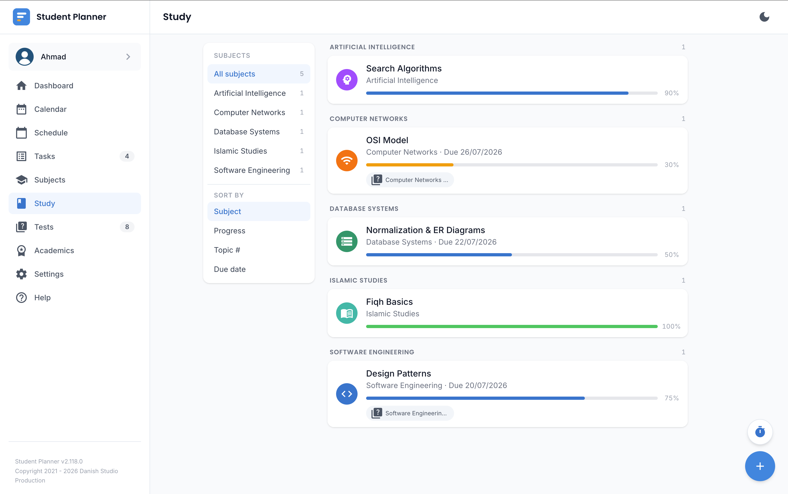

# Study Topics

Break a subject down into individual topics/chapters and track your revision progress on each one —
separately from the assignment-style tracking in [Homework & Tasks](homework.md).

## Progress

Each topic has a progress percentage you update as you revise it. A topic can also carry its own due
date (for example, "revise by the night before the test") independent of any linked test's date.

## Linking to a test

Linking a study topic to a [quiz/test](quiz.md) is what powers the Dashboard's **focus suggestions** —
topics under 100% progress with a linked test coming up soon are surfaced first, so you always have a
concrete answer to "what should I revise next" instead of having to work it out yourself.

!!! tip "A task can double as a study topic too"
    You're not limited to dedicated study topics for what a quiz tests you on — a
    [homework/task item](homework.md) can also be linked as something a quiz draws on (a specific lab
    or tutorial, say), and it'll show up alongside your topic links wherever a quiz shows what it's
    testing.

## Sorting

Sort your topic list by topic number (the order you'll actually study them in) or by due date (what's
most urgent) — whichever is more useful for how you plan.
