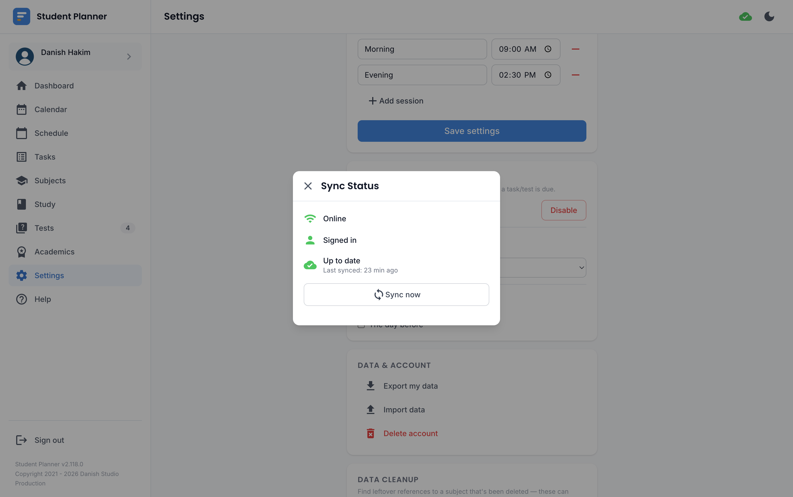

# Offline & sync

Student Planner is **offline-first** — every page reads and writes to a local database on your device
first, so the app works with no connection at all, not just as a fallback.

## How syncing works

If you're signed into a real (non-guest) account and online, your local changes sync to the cloud
automatically in the background, and you can see the current status via the small cloud icon in the top
bar. Clicking it opens a status panel with your connection, account, and sync state, plus a **Sync now**
button to force an immediate sync instead of waiting.

A guest session never syncs — see [Guest mode vs. an account](getting-started/guest-vs-account.md) — so
that cloud icon doesn't appear for a guest at all.

## What happens when you're offline

Nothing is blocked. Add a class, log a grade, complete a task — it all saves locally immediately. The
moment you're back online (and signed in), those changes push up automatically; nothing needs to be
redone manually.

## Conflicts

If the same record was changed on two devices while one was offline, the app resolves it by keeping
whichever edit happened most recently (last-write-wins) and shows a small hint in the UI so you're aware
a conflict was resolved rather than it happening silently.

## Installing as an app

Student Planner is a PWA — most browsers offer an "Install" or "Add to Home Screen" option, which gives
it its own icon and window, launching without browser chrome, just like a native app.

!!! warning "iPhone/iPad (iOS)"
    This step isn't optional on iOS the way it is elsewhere:

    - **Push notifications require it.** Safari only delivers Web Push to a PWA that's been added to
      the Home Screen and opened from there — see [Notifications](features/notifications.md#iphoneipad-ios).
    - **Guest data can be evicted.** If you don't open the app for about two weeks, iOS may clear its
      local storage automatically to free up space. A guest session has no cloud backup, so that data
      would be gone for good — either open the app periodically or
      [create an account](getting-started/guest-vs-account.md) if you're on iOS long-term.
    - There's no periodic background sync on iOS (a platform-wide restriction, not specific to this
      app) — syncing happens when you actually open the app, not silently in the background while it's
      closed.
